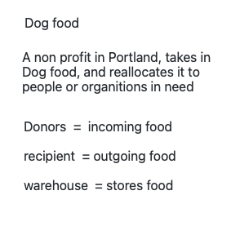

# The Dog Food App

## Our Group Project

Christa Cooper - https://github.com/usmc-Blockhead

Hayln Anderson - https://github.com/hayln-alaine

Jordan Ulves - https://github.com/UJordan

We are students at NuCamp Coding Bootcamp and decided to work together on this project from start to finish.

The idea:

Hayln knows of a Non-profit in her area that takes in dogfood donations and redistributes it to those that need it. Right now they have no Inventory control method of keeping track of what they have on hand, so we decided to try make them one.

The Wireframe we came up with during the planning meeting was out guiding

GitHub: We used version control to work together thru GitHub, using branches and pull requests with protection rules to prevent code overwriting by each other

We decided the plan would be Jordan create the Homepage, carousel, and buttons. Hayln created the data. We decided to start with just the Donor page, because the other pages would be very similar, so if we could get the donor page to work, then we could recreate the other page with the chages they would need. Christa worked on the donor page and stackNavigator.

For the first few feeks the project just had the two pages Home Page, and Donor Page

punch list:

~~-list does not scroll~~

-save new - finish in Node by adding routes and backend

~~-date picker~~

-fix FoodModal quanity, aisle, bin useState not selecting

~~-fix warehouse list of foods/what it says when they are clicked on~~

-look for carousel controls

-finish accessibilty
